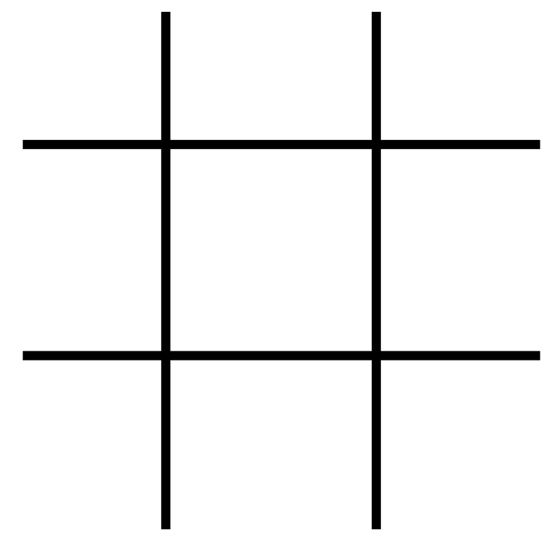
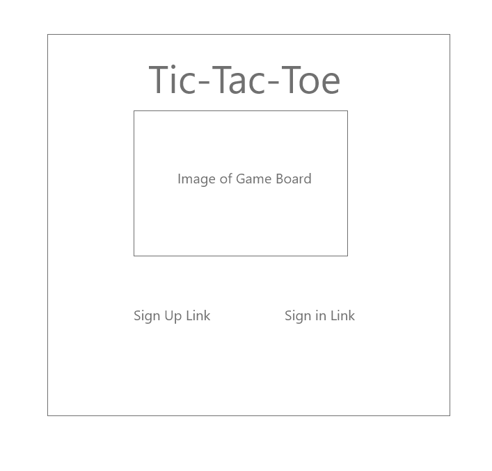
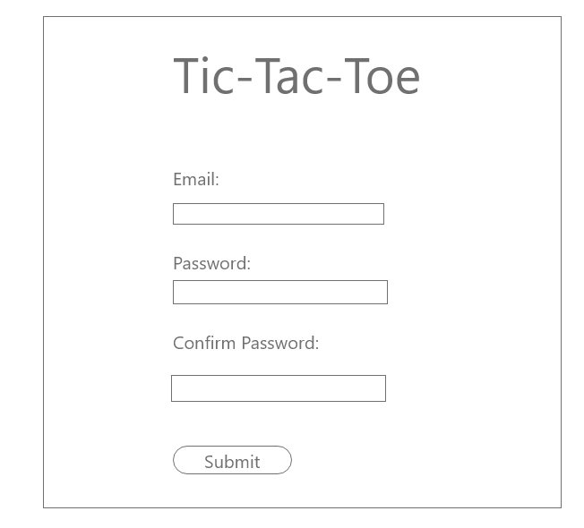
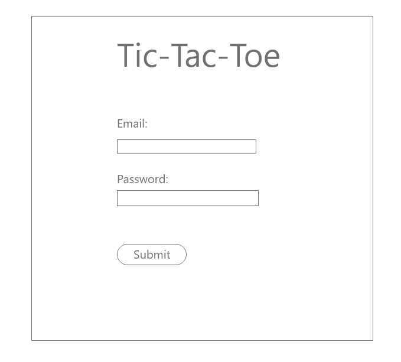
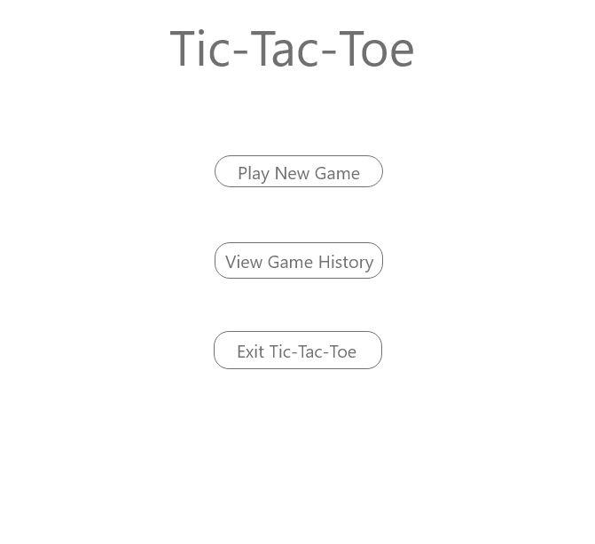
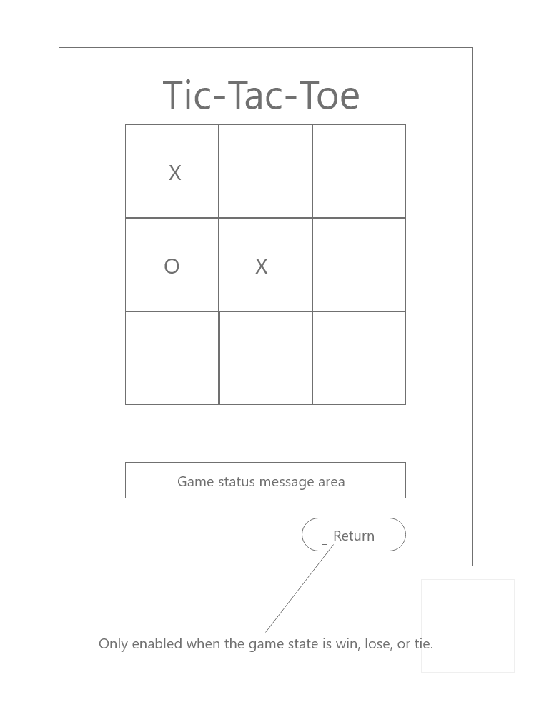
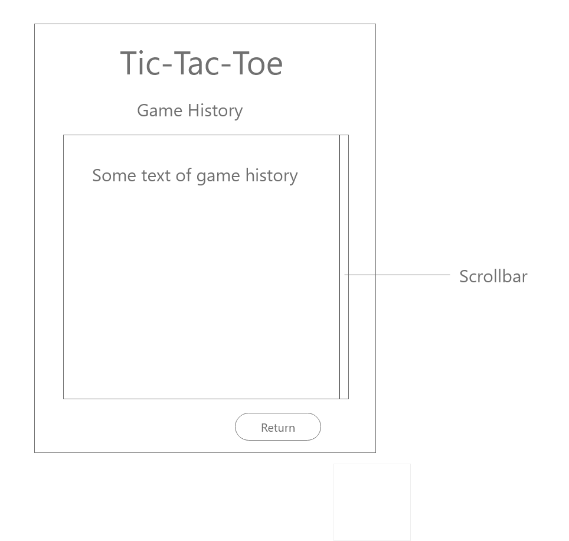

# TIC TAC TOE: A Description

This application is a simple, single-player version of Tic Tac Toe. The player always
starts as the "X" player and then is the "O" player. This alernation takes place until
either one "player" wins or both players tie.

If a user is new to the application, the user can create an account. From there the user
may signin to the app. They may change their password, play a game, view the number
of games played, and of course exit the app.

Whether a player wins, loses, or ties, there will be a visual representation of the 
winning, losing, or tied state. The winning row(s) will be highlights, or in the case
of a tie, all the cells will be highlighted with the same color.

***

## Planning Story
The first thing that I did was to create 7 user stories and 6 wireframes based upon my
initial understanding of the requirements. 

Styling is my Kryptonite because I do not possess any artistic sensibilities. But I tend
to like dark themes and chose to go for that. Since Tic Tac Toe is a simple game, I wanted
the game to look polished but also clean and simple. I used Bootstrap to style the handful of
forms and buttons. I wanted a hint of the Boostrap look, but I overrode Bootstrap's primary color
using SCSS to a shade of purple that I like so as not to look like every other Bootstrap site.
I also used Flexbox to align buttons and Bootstrap to implement the game board.

I first took care of the low-hanging fruit by implementing the signup, signin, change password,
game options, and signout pages along with the corresponding web service invocations. I had this 
work complete before I tackled the game itself so as to make quick progress.

It became clear that since we are manually implementing an SPA, that I wanted a pseudo-state
machine to hide and show the approptiate sections of the page, and properly show and hide 
buttons, sort of how Angular's router might work. That kept that logic in one place,
reduced redundant jQuery queries of the DOM, and generally kept things DRY.

I also knew that I would create a JS module to implement a "game engine". This keeps track
of the player's moves, updates the game board, and scores each move. Due to my experience 
as a software developer and the simpleness of Tic Tac Toe, I was able to design this in
my head while relaxing. The idea came to me while I was in "diffuse mode" as most good ideas do.

When I started developing the game engine, I ran into perhaps my biggest problem. I could not
load other modules into the engine. However, I quickly realized my problem was due to circular
depdendencies with my CommonJS modules. I made sure that everything included the game engine
and not the converse.

I chose to focus on the game engine before I handled the web service call for update game.
That is because the web service call was low-hanging fruit. I did need to refactor my game
engine after I had the web service call in place; I had to refactor a single method into two.
I had to handle a gameboard click and first determine whether the user clicked a gameboard
cell already played. If so, then the engine returns from the method and returns control to
the user. If the cell is a new cell, the the move needs to be scored in order to tell the 
update game service whether the game is complete. 

The update game service is invoked.

If that is successful, the engine saves the "gameboard" returned by the service for scoring purposes.
Then the game board in the HTML is updated using .png images. I realized that since I was placing
an image inside a gameboard DIV cell, and my moves were triggered by handling a DIV cell
click, that the user could also click the image since it does not fully cover the grid 
cell. So when a user clicks a cell already played, the event needs to check if either 
the cell or the image was clicked, and was that cell already clicked. That was my second
biggest issue, but it did not take me long to resolve it. 

Because I learned "to count" in Discrete Mathematics while earning my MS in Computer Science,
I determined that there are 8 ways to win the game, and only a single way to tie, assuming that
the user doesn't quit midgame. I also realized that a win cannot happen before the 5th move. So
I added a small check to not examine the game board until the game is at move 5 or later. That is
kind of overkill for this game, but that kind of thinking can mean much in a real-word project. 

Due to my ability "to count" previously mentioned, it is possible for the first player to win two
ways on the last move of a game. Note that through naive game play, X can win on the last move by
placing X in one of the corners and by having Xs in either diagonal, as well as having X's in the
top or bottom row, or the left or right columns. It is also possible through naive game play to
win on the last move by securing both diagonols. My scoring algorithm will detect that.

My friend Paul Muller designs and builds virtual displays, 3D virtual walkthroughs, and such for a living.
He quikcly created for me the graphical bits that I use in the game, such as the animated GIF on the
homepage, and the graphics for the gameboard itself.

Towards the end of development I did a lot of refactoring to reduce code; I see software developers 
as sculptors, chisling away code to its bare essence. I also added comments.

Since we only had 4 days for the project and so as not to succumb to "Parkinson's Law", I decided
to focus on meeting the minimum requirements with no issues rather than trying to create fancy features
with bugs. I wanted a full day available just for manual testing. I wanted to translate the game into
Russian because I speak Russian, but I thought I would end up rushing to finish that feature.
In the real world, giving the business what they want with minimal defects and on time and budget 
is what counts. I also decided not to do a responsive design until I am satified for how the app looks
at full fidelity.

***

### User Stories

- As a User I want to sign up so that I may play tic-tac-toe.
- As a User I want to sign in once I have created an account so that I may play tic-tac-toe.
- As a signed in User I want to change my password so that I can ensure that my account is secure.
- As a signed in User I want to sign out from the app so that my session is closed.
- As a player I want to be notified on-screen when I win, lose, or tie so that I have conclusion to a game.
- As a player who just finished a game, I want to be able to start a new game so that I can play tic-tac-toe
    again.
- As a player who has played games, I want to see a count of the number of games that I played so that
  I can determine whether I have a life.

***

### Technologies Directly Used

- JavaScript
- jQuery
- HTML/CSS/SCSS
- Bootstrap 4 (forms, gameboard, buttons)
- Web services
- Grunt / Webpack

***

### Unsolved Problems

- I have no usolved problems based upon the requirements given to me.

***

### Nice-to-haves / Technical Debt
* Improve the styling including support for responsive design.
* Translate the text of the game into other languages since my main
  interests outside of tech is linguistics and language.
* Eliminate api.js, events.js, and apiPromiseHandlers.js. A cleaner design would be
* to intergrate this functionality into "verticals" for better separation of concerns
  and reusability. It would also allow the pseudo-state machine to be more powerful
  by managing state transitions without the various screens telling the pseudo-state
  machine where to go for the next page.
* Write automated unit tests using a framework such as Jest.
* Write automated UI tests using Selenium.
* Improve the psuedo-state machine.
* Improve the game engine to eliminate CommonJS circular dependencies.
* Validate user input; this was not a requirement.
* Use ES classes.
* Eliminate magic numbers and strings.
* Improve comments.
* Check for connection before invoking web services. The app hangs if
  I disconnect my WiFi.
* Make the status / notification area its own class or module. Then it could
  worry about writing info versus error messages, change font colors, etc.  
  
***

#### Wireframes:

